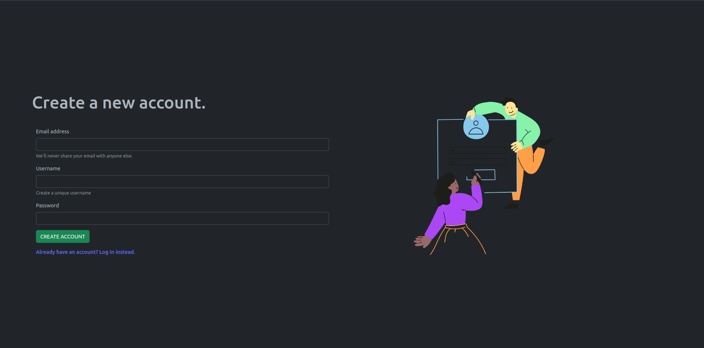

# TaskTrain Client 
TaskTrain is a simple task tracker built with Ruby on Rails and React

## REQUIREMENTS
### Prerequisites
* node v14.17.4 and above
* npm 6.14.14 and above
* React 18.2.0

## Setup Instructions

This section will guide you through setting up and running this repository on your local machine.

### Project

* Clone the repository
    ```
    git clone https://github.com/sinatra-pod/moringa-library.git 
    ```

    or

    ```
    git clone git@github.com:sinatra-pod/moringa-library.git 
    ```
* Navigate to the project folder using the following command
    ```
    cd TaskTrain
    ```
* To interact with the front-end part of the application, navigate to the `client` folder
    ```
    cd client
* To run the front-end part first ensure that you run 
  ```
  npm install 
* To start the application run
  ```
  npm run dev
  ```

Screens
-------

Have a look at what I have been working on.

| Login | Register |
| ----- | -------- |
|  |  |


Meta
----
Authors:
* [Ian Okumu](https://github.com/otsembo)
* [please add you author creds here]

**Status**: `maintained, and is currently in development`

**Version**: `v0.1.0`

**React Version**: `18.2.+`


Usage
-----


## License
This project is licensed under the MIT License

Documentation
-------------
You can see the documentation over at **Read the Docs**

Resources
-------------

* https://react-typescript-cheatsheet.netlify.app/